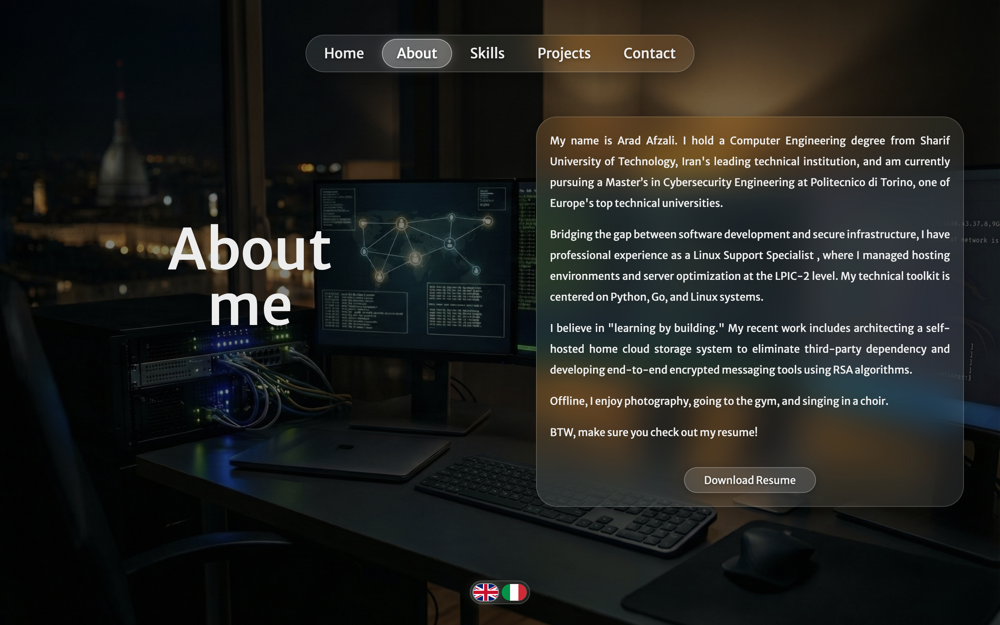
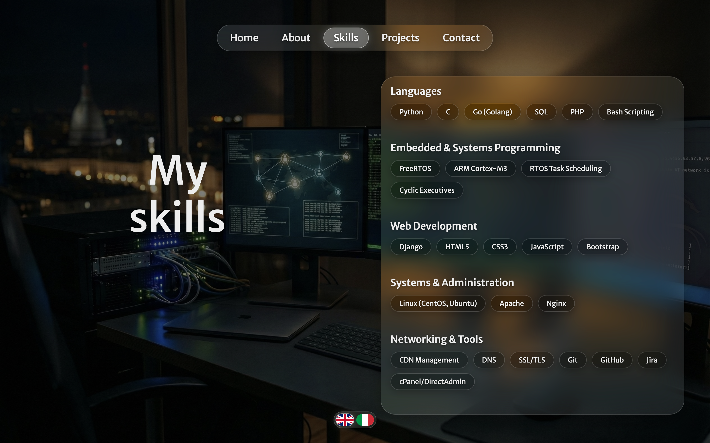
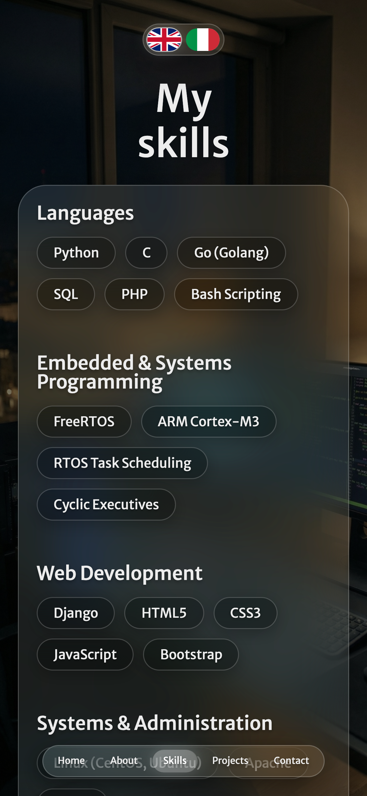
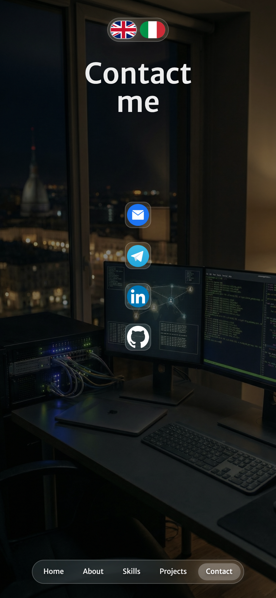
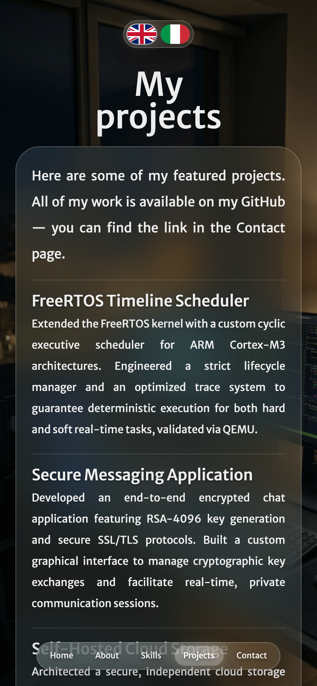

# Personal-Website
This is the code for my personal website that I have created using HTML,SCSS, CSS and JavaScript. It contains information about my background, skills and contact details. I have uploaded it on GitHub so that anyone can view it online or download it and edit it for their own use.

# Screenshots

Here are the screenshots of each page in desktop mode and in mobile view.

## Desktop View

## Mobile View

  
  
  
  
  

